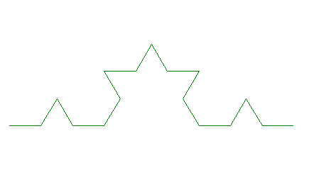
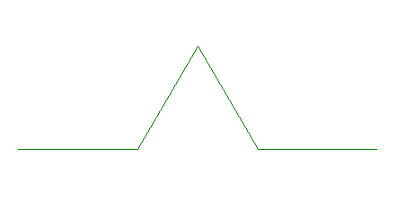
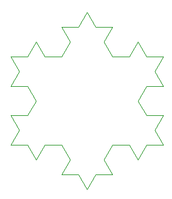

# TP Récursivité :

------

## 1. Courbe de Koch : 

> Prérequis : Module turtle

La courbe de koch est une figure récursive pouvant ressembler à cela : 



Celle-ci possède un cas de base d'ordre 0, il est représenté par un segment. Le cas d'ordre 1 est ce même segment découpé en 3, la partie du milieu est quand à elle un triangle équilatéral sans sa base (ou un chapeau ^). 


*Courbe de koch niveau 0*



*Courbe de koch niveau 1*

Le cas d'ordre 2 reprend le cas d'ordre 1 est pour chaque segment, le redécoupe et dessine ce "triangle".

Le cas d'ordre n reprend le cas d'ordre n-1 puis refait la même chose... Ainsi de suite

1. Ecrire de manière récursive le code de la fonction courbe_koch(n, cote) permettant de dessiner cette courbe.  

Nous voulons obtenir maintenant un flocon de koch. Celui-ci répète plusieurs fois la courbe de koch afin de revenir à son point initial.

2.  Ecrire le code de la fonction flocon() qui dessine le flocon de la courbe de koch



*Flocon de koch (niveau 2)*

## 2. Triangle de Pascal : 

Le triangle de pascal représente les coefficients binomiaux sous la forme d'un triangle :

coef(n,p) : *fonction permettant de calculer les coefficients*

coef(n,p) :

- 1 **si p = 0 ou n == p**
- coef(n-1,p-1) + coef(n-1,p) **sinon**

1. Ecrire le code de la fonction coef(n,p)

 Le sommet du triangle est le résultat de coef(0,0), la première ligne elle est représenté par coef(1,0) et coef(1,1), ainsi de suite pour les autres lignes

2. A l'aide de deux boucles écrire un code permettant d'afficher les 6 premières lignes du triangle.

## 3. Recherche dichotomique :

La recherche dichotomique fonctionne sur un tableau trié, et permet en fonction de la longueur du tableau n de trouver un élément de façon optimale.

Voici le code de la recherche dichotomique (programme 1ère) de manière itérative :

```python
def recherche_dichotomique(t, v):
    debut = 0
    fin = len(t)-1
    while debut <= fin :
        milieu = (debut + fin) // 2
        print(milieu,debut,fin)
        if t[milieu] == v :
            return True 
        else:
            if t[milieu] > v :
                fin = milieu - 1
            else :
                debut = milieu + 1
    return False
```

1. Ecrire ce code en récursif