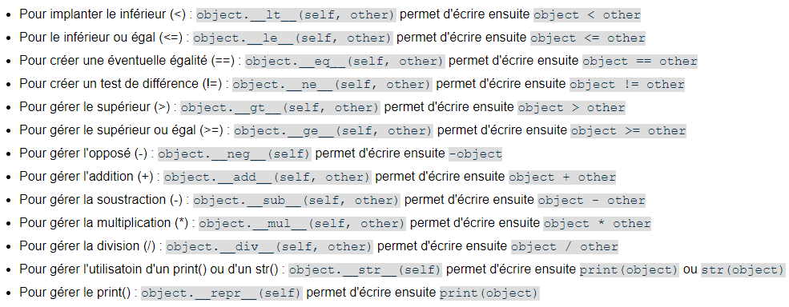

# Programmation orientée objet

------

## 1. Rappel : Programmation impérative

La programmation impérative est un paradigme de programmation (une méthode de programmation) composé d'une suite d'instructions. C'est le type de programmation que l'on utilise jusqu'à présent. On retrouve ce paradigme dans les langages tels que Python, Javascript ou encore le langage C.

Si par exemple nous voulons créer un code qui utiliserait des étudiants, stockerait leurs spécialités, leur âge, leur nom, etc. Nous pourrions utiliser un dictionnaire par exemple.

```python
dico = {'Nom': 'Dupond','Prenom': 'Bob', 'Spe1' : 'NSI', 'Age': 17} 
```

Ici le dictionnaire contient des informations qui peuvent s'apparenter à un étudiant. Il est possible de changer les clés, les valeurs des clés. Mais en réalité nous manipulons un dictionnaire. Si nous vérifions le type de *dico* il s'agit d'un dictionnaire, non d'un étudiant.

La programmation objet va permettre, de créer un type *Etudiant* qui contiendra des caractéristiques qui lui sont propres (nommées **attributs**) et des fonction appropriées  (nommées **méthodes**).

## 2. Programmation orientée objet 

La programmation orientée objet permet donc de créer son propre type. Le langage python possède nativement différents types tels que le type int, str, list (tableau), dict. 
Ces types possèdent des méthodes, par exemple le type str possède la méthode *upper()* permettant de mettre en majuscules tous les caractères de la chaîne.

```python
>>> s = 'Je suis un type str'
>>> s.upper()
'JE SUIS UN TYPE STR'
```

Le but ici est donc de réaliser la même chose sur un type que nous allons créer. (le type *Etudiant*)

Avant d'écrire la moindre ligne de code, il définir la classe :

```python
class Etudiant :
```

>  Il est important que le nom de la classe commence par une majuscule.

### 2. 1. Le constructeur 

Le constructeur est une méthode(fonction) permettant d'initialiser votre type. Lorsque l'on va créer un étudiant c'est la méthode constructeur qui est appelée. En python elle est définie par '\_\_init\_\_()'

<u>Voici le constructeur pour notre classe *Etudiant* :</u>

```python
class Etudiant : 
	def __init__(self,nom_etu,prenom_etu,spe1_etu,age_etu) :
        self.nom = nom_etu
        self.prenom = prenom_etu
        self.spe1 = spe1_etu
        self.age = age_etu
        self.nom_complet = nom_etu + ' ' + prenom_etu
        if self.age < 18 :
            self.peut_avoir_son_permis = False
        else :
            self.peut_avoir_son_permis = True
```

 Plusieurs choses sont à noter ici :

- *\_\_init\_\_* est une méthode de constructeur, son nom ne doit pas changer.
- ***self* est un paramètre que l'on retrouvera dans toutes les méthodes de nos classes.**
  - *self* permet de désigner l'objet que l'on manipule
- ***nom, prenom, spe1, age, nom_complet, peut_avoir_son_permis* sont des **attributs** de la classe *Etudiant* 
  - Un étudiant est donc composé d'un nom, prénom, spe1, age, permis_voiture et d'un nom_complet.
- ***nom_etu,prenom_etu,spe1_etu,age_etu*** sont ici les paramètres de la fonction. Pas des attributs. 
- L'attribut *peut_avoir_son_permis* est le résultat d'une condition. 
  - Il est possible de boucler, de mettre des conditions dans un constructeur

> Le constructeur est une fonction comme une autre, pouvant comporter des boucles, des conditions. L'utilité principale de celui-ci est avant tout de créer les attributs de notre objet.

A ce stade nous pouvons créer notre objet *Etudiant*

```python
>>> e = Etudiant('Dupond','Bob','NSI',17)
>>> e.nom
'Dupond'
>>> e.peut_avoir_son_permis
False
>>> e.age
17
```

> Le paramètre self correspond ici à e. Il n'apparait pas dans les parenthèses. Il s'agit de la variable stockant l'objet (e ici)

### 2. 2. Méthodes associées à la classe 

Une fois notre constructeur crée il faut pouvoir manipuler l'objet. Ici nous pouvons accéder à ses attributs. Mais nous allons créer des méthodes permettant de changer, ajouter des attributs. 

Supposons que l'étudiant change de spécialité. Bob voudrait arrêter de faire NSI (impossible, mais supposons pour l'exemple).

```python
def change_spe(self,nouvelle_spe) :
    self.spe = nouvelle_spe	
```

<u>Pour appeler la méthode :</u> 

```python
>>> e.change_spe('SES')
```

> self est toujours présent lors de la définition de la méthode. Lors de l'appel, il s'agit toujours de e.

Il est possible d'écrire le code que l'on veut dans une méthode. Libre à votre imagination. 
On pourrait créer une méthode *anniversaire* par exemple :

```python
def anniversaire(self) :
	self.age = self.age + 1
	if self.age == 18 :
		self.peut_avoir_son_permis = True
```

Si l'anniversaire de l'étudiant passe, alors il gagne 1 an et s'il a 18 ans alors il est éligible au permis de conduire.

Imaginons maintenant qu'il soit possible d'avoir une nouvelle spécialité.

```python
def nouvelle_spe(self,new_spe):
	self.spe2 = new_spe
```

```python
>>> etudiant2 = Etudiant('Timo','Alice','SES',17)
>>> etudiant2.spe1
'SES'
>>> e.nouvelle_spe(self,etudiant2.spe1)
>>> e.spe2
'SES'
```

Ici nous utilisons la spé de l'étudiant 2 (Alice) pour l'étudiant 1. Il y a peu intérêt dans cet exemple, mais il permet de démontré que c'est possible. 
Un objet peut dépendre d'un autre, que cela soit dans un paramètre, un attribut, etc.

### 2. 3. Méthodes particulières

Avec un type natif à Python il est possible de faires certaines opérations. Par exemple, il est possible de comparer deux chaînes de caractères.

```python
>>> s = 'oui'
>>> s2 = 'non'
>>> s == s2
False
```

<u>Comparer deux objets :</u>

Actuellement il est impossible de faire la même chose avec nos étudiants. C'est à nous de définir comment comparer (s'il y en a le besoin) nos objets.

```python
def __eq__(self,obj2):
	return self.spe1 == obj2.spe1
```

Cette méthode propre à python permet d'effectuer l'opération suivante.

```python
>>> e = Etudiant('Dupond','Bob','NSI',17)
>>> etudiant2 = Etudiant('Timo','Alice','SES',17)
>>> e == etudiant2
False
```

<u>Représenter un objet :</u>

Actuellement appeler un objet renvoie ceci :

```
>>> e = Etudiant('Dupond','Bob','NSI',17)
>>> e
<__main__.Etudiant object at 0x03DC5890>
```

 Avec la fonction *\_\_repr\_\_(self)* il est possible de donner une représentation à notre objet. 

```python
def __repr__(self):
        return self.nom + ' ' + self.prenon  
```

```python
>>> e = Etudiant('Dupond','Bob','NSI',17)
>>> e
Dupond Bob
```

> Il existe d'autres méthodes natives à python permettant d'effectuer tout type d'opération



### 2. 4. Pour aller plus loin :

Il est possible de rendre les attributs privés. Actuellement nous pouvons modifier/ accéder aux attributs d'un objets simplement par son nom.

```python
>>> e = Etudiant('Dupond','Bob','NSI',17)
>>> e.nom
'Dupond'
```

En utilisant des types privés il n'est plus possible d'accéder directement aux attributs d'un objets. Cette modification se passe dans le constructeur.

```python
class Etudiant : 
	def __init__(self,nom_etu,prenom_etu,spe1_etu,age_etu) :
            self.__nom = nom_etu
            self.__prenom = prenom_etu
            self.spe1 = spe1_etu
            self.age = age_etu
            self.nom_complet = nom_etu + ' ' + prenom_etu
            if self.age < 18 :
                self.peut_avoir_son_permis = False
            else :
                self.peut_avoir_son_permis = True
```

Ici l'attribut \_\_nom et \_\_prenom sont privés. Pour accéder/modifier à leur valeur, il faut créer une méthode associée. 

```python
def get_nom(self):
	return self.__nom

def set_nom(self,nouveau_nom):
	self.__nom =  nouveau_nom
```

Ces méthodes sont appelées des accesseurs et modificateurs. Elles sont optionnelles selon les cas.  
