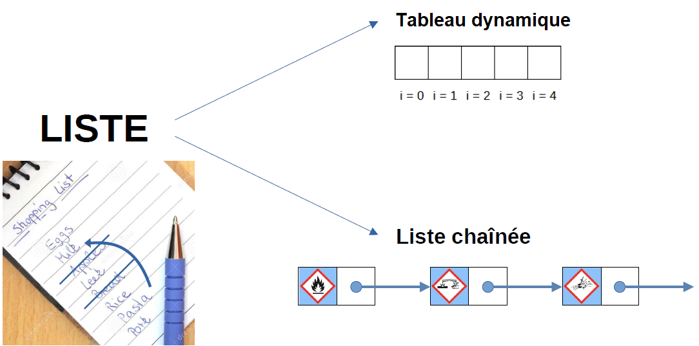
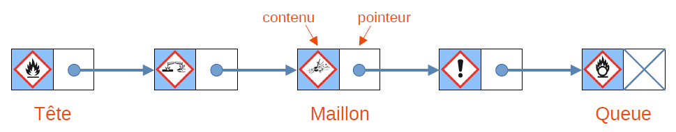
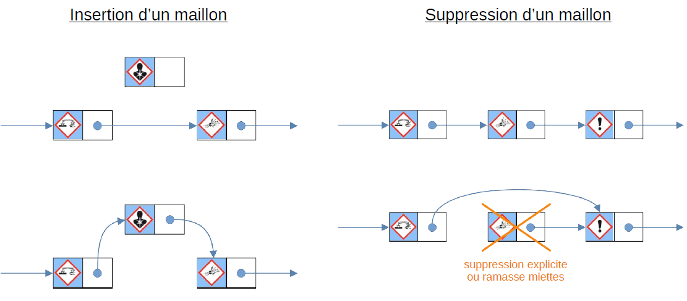
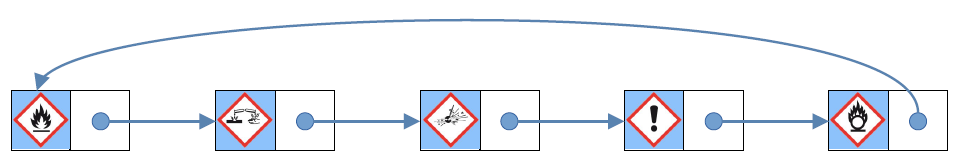
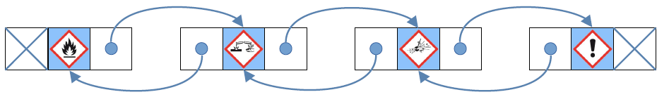

# **Les listes chainées**

------

## **1. Tableau et liste chainée**

Il existe plusieurs type de liste : les tableaux dynamiques vu en première (*list*) et les listes chainées qui peuvent être simplement ou doublement chainées.

L'accès aux éléments d'un tableau se fait par l'indice et est (quasi) instantané (En O(1)), l'accès à un élément dans une liste chaînée dépend de son implémentation et est en O(n). Car une liste est en réalité une succession d'éléments qui se suivent. 

Ces éléments s'appellent **Listes (ou Maillons)**

## 2. Implémentation : Liste simplement chainée

### **2. 1. Structure**

Pour la réalisation d'une liste, il nous faut comprendre comment la structure fonctionne.

Comme dit précédemment, une liste contient plusieurs éléments qui sont nommés :

- **Tête** qui correspond au premier élément de la liste ;
- Les autres sont appelés **Queue** qui correspondent aux autres éléments de la liste.

Nous allons nous intéresser aux listes simplement chainées, c'est à dire aux listes constitués de 2 éléments :

- Un premier attribut qui correspond au **contenu** du maillon ;
- Un deuxième attribut qui correspond au **pointeur** vers le maillon suivant.

La liste chainée est entièrement définie par l'adresse de sa tête (son premier élément).

### **2. 2. Opérations**

Lorsque l'on ajoute ou supprime un élément dans un tableau, nous avons des opérations qui s'exécutent en plus puisque ce dernier doit ranger son contenu et donc doit manipuler ses indices.

Avec une liste chainée, ce problème n'existe pas puisque lors d'un ajout ou d'une suppression, on va manipuler directement sur les maillons en changeant les pointeurs :

## 3. **Liste doublement chainée et cyclique**

### **3. 1. Liste chainée cyclique**

Une liste chainée cyclique est une liste chainée dont la queue pointe vers la tête.

### **3. 2. Liste doublement chainée**

Une liste chainée doublement est une liste qui utilise aussi des maillons mais ces derniers sont constitués de 3 attributs :

- le pointeur vers l'élément précédent
- le contenu 
- le pointeur vers l'élément suivant

L'avantage de ces listes est qu'il est possible de faire un retour en arrière sans avoir besoin de reparcourir l'ensemble de la liste.

