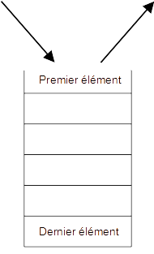
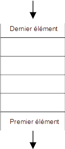

# Structure de données : Pile et File

------

## 1. Rappel :

<u>**Structure de données**</u> : Collection d'information dans laquelle il est possible de stocker, traiter, organiser, extraire des données.

Les structures de données connues à ce jour sont : Les tableaux, les dictionnaires, les chaînes de caractères, les n-uplets. Chacune de ces structures possèdent des caractéristiques propres qui créent des avantages et des inconvénients selon la situation.

De plus, ces types sont natifs à python, et aux autres langages selon les cas. Nous n'avons donc ici aucune idée de comment le type *dict* ou *tuple* est crée par exemple.

Les structures de données Pile et File ne sont pas natives à python et nous aurons donc besoin de les implémenter.

## 2. Interface et implémentation : 

Ces deux termes sont particulier et très important pour ce chapitre. Alors un petit rappel n'est pas de trop.

<u>**Interface :**</u> L'interface d'un type est définie par les méthodes qui lui sont associées. 

**<u>Implémentation :</u>** L'implémentation d'un type est la manière dont on va le coder.

Il faut bien faire la distinction entre les deux termes.

## 3. Pile

### 3. 1. Définition

Une pile est une structure de données dans la quelle les derniers éléments entrant dans la structure seront les premiers à en sortir, nous appelons ce principe **LIFO (Last In First Out)**. Afin d'imager cette structure nous pouvons penser à une pile d'assiettes par exemple.

Ici seul le premier élément est accessible.  

### 3. 2. Interface

Méthodes associées à la pile :

- Empile : Méthode permettant d'empiler un élément.
  - L'élément sera positionné au haut de la pile
- Depile : Méthode permettant d'enlever un élément.
  - L'élément enlever sera celui en haut de la pile.

- Est_vide : Permet de savoir si la pile est vide ou non

On peut ajouter d'autres méthodes :

- Taille : Permet de savoir le nombre d'élément de la pile
- Top : Permet de connaître l'élément au dessus de la pile.

## 3. File

### 3. 1. Définition

Une file est une structure de données dans la quelle les derniers éléments entrant dans la structure seront les dernier à en sortir, nous appelons ce principe **FIFO (First In First Out)**. Afin d'imager cette structure nous pouvons penser à une file de voiture sur une route par exemple (ou une file d'attente).

Ici seul le premier élément peut sortir de la structure.    

### 3. 2. Interface

Méthodes associées à la pile :

- Enfile: Méthode permettant d'enfile un élément.
  - L'élément sera positionné au haut de la file
- Defile: Méthode permettant d'enlever un élément.
  - L'élément enlever sera celui en bas de la file.

- Est_vide : Permet de savoir si la file est vide ou non

On peut ajouter d'autres méthodes :

- Taille : Permet de savoir le nombre d'élément de la file
- Top : Permet de connaître l'élément au dessus de la file.

## 4. Conclusion

Les deux structures ont une interface très semblable. Seul le principe FIFO / LIFO peut les différencier. 

La suite du chapitre se concentrera sur l'utilisation de ses structures et leurs implémentations.