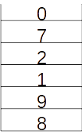
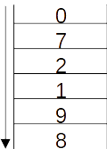

# TD Pile et File

------

Le but du TD est de manipuler des piles et des files sans avoir d'implémentation.

## 1 Application de cours

### 1. 1. Pile

<u>Voici une pile :</u>

1. Quel sera l'état de la pile après l'utilisation des méthodes suivantes :
   - Depile(), Depile(), Empile(7), Empile(8),Depile()
   - Que renvoie la méthode top() ?
2. Reprenons la pile de l'image, que faut t'il faire comme méthode pour que Est_vide() soit vrai ? 
3. En partant de 0 écrire les méthodes permettant de créer une pile contenant les numéros dans cette ordre 19982018. (1 est en bas de pile)

### 1. 2. File

<u>Voici une file :</u>

1. Quel sera l'état de la file après l'utilisation des méthodes suivantes :
   - Defile(), Defile(), Enfile(7), Enfile(8),Defile()
   - Que renvoie la méthode top() ?
2. Reprenons la file de l'image, que faut t'il faire comme méthode pour que Est_vide() soit vrai ? 
3. En partant de 0 écrire les méthodes permettant de créer une file contenant les numéros dans cette ordre 19982018. (1 est en haut de File)