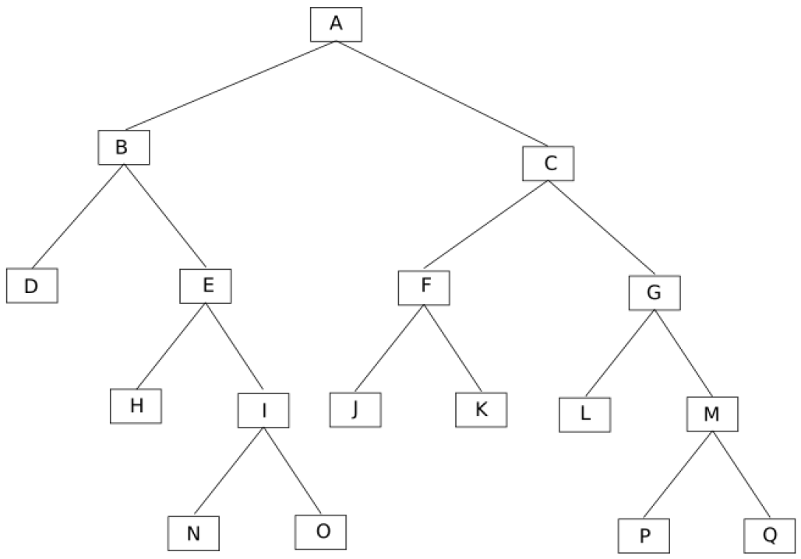

# **Arbres binaires**

------

## 1. Vocabulaire

Un arbre binaire est une structure de donnée récursive. Il est caractérisé par plusieurs éléments appelés **nœud**. 

Le nœud initial de l'arbre se nomme **racine**.

Dans un arbre binaire, un nœud peut avoir au maximum 2 **fils** et un nœud ne possédant pas de fils est appelé **feuille**.

À partir d'un nœud (qui n'est pas une feuille), on peut définir un **sous-arbre gauche** et un **sous-arbre droit**.

<u>Voici un exemple d'arbre :</u>

## 2. Mesures 

Il y a trois données à relever sur un arbre :

- La **taille** qui correspond à la somme des nœuds de l'arbre (racine et feuilles y compris) ;
- La **profondeur d'un nœud** qui correspond aux nombre d'arêtes séparant le nœud en question de la racine de l'arbre (la racine a donc pour profondeur 0)
- La **hauteur** qui correspond à la profondeur maximale de l'arbre + 1. (La racine a donc pour hauteur 1)

## 3. Arbre binaire de recherche

Un arbre binaire de recherche (ou **ABR**) est utilisé pour réaliser « efficacement » des opérations de recherche de valeur, mais aussi des opérations d'insertion et de suppression de valeurs. 

Les valeurs des nœuds de l'arbre doivent donc appartenir à un ensemble ordonné.

Un ABR a pour tout nœud ayant une valeur *e* :

- les valeurs de tous les nœuds du sous-arbre gauche sont inférieures ou égales à *e* ;
- les valeurs de tous les nœuds du sous-arbre droit sont supérieures à *e*.