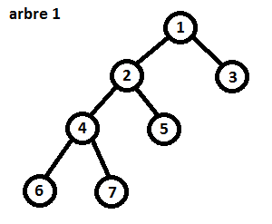
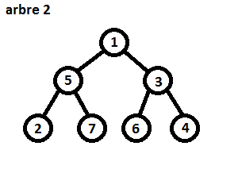
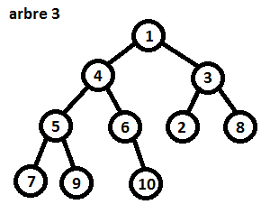
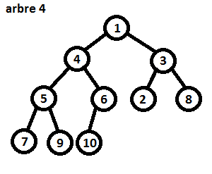
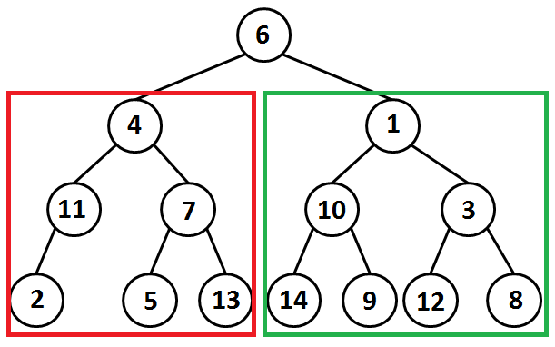
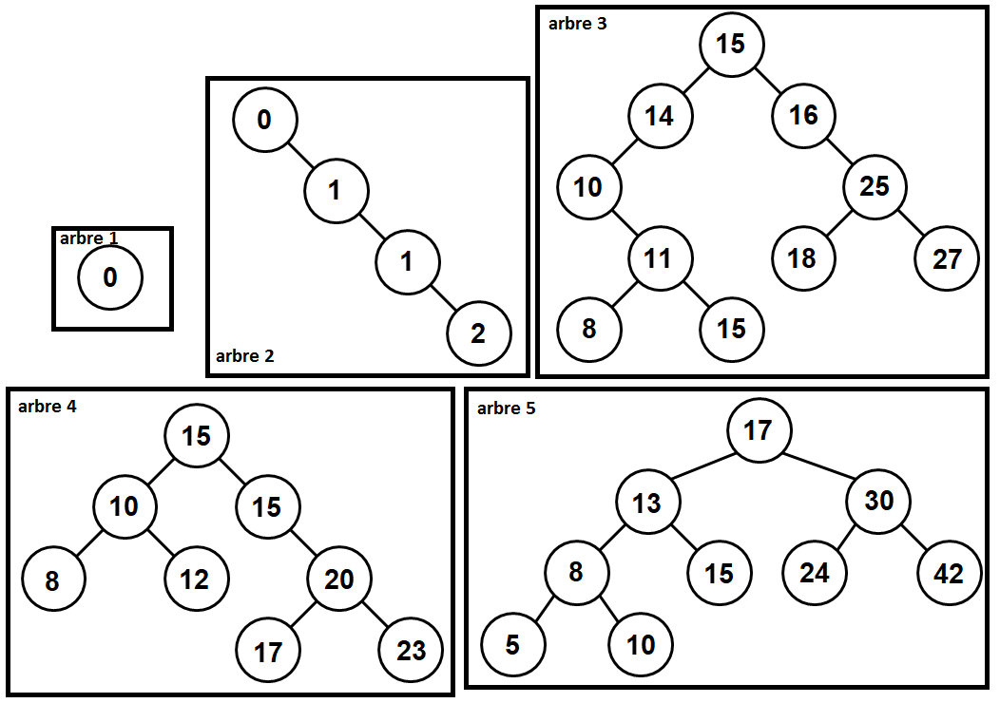

# Arbres binaires

------

## 1. Arbres et définitions

Soit les 4 arbres binaires suivant :

<div style="display: flex; justify-content: space-around;">



</div>

<div style="display: flex; justify-content: space-around;">



</div>

1. Compléter le tableau :

| arbres  | taille | hauteur | Profondeur |
| :-----: | :----: | :-----: | :--------: |
| Arbre 1 |        |         |            |
| Arbre 2 |        |         |            |
| Arbre 3 |        |         |            |
| Arbre 4 |        |         |            |

2. Dessiner les arbres de ces définitions :

```python
vide = Arbre_test()

# Premier arbre : F
A = Arbre_test("A", vide, vide)
E = Arbre_test("E", vide, vide)
I = Arbre_test("I", vide, vide)

B = Arbre_test("B", A, vide)
D = Arbre_test("D", vide, E)
H = Arbre_test("H", vide, I)

C = Arbre_test("C", B, D)
G = Arbre_test("G", vide, H)

F = Arbre_test("F", C, G)

# Deuxième arbre : J
J = Arbre_test("A", Arbre_test("B", vide, Arbre_test("F", vide, vide)), Arbre_test("D", Arbre_test("E", vide, vide), Arbre_test("C", vide, vide)))
```

3. En utilisant la classe **Arbre_test** de la question précédente donner la définition :

- en plusieurs affectations (plusieurs lignes) de l'arbre ayant pour racine le nœud **4** ;
- en une seule affectation (une ligne) de l'arbre ayant pour racine le nœud **1**.



## 2. Arbre binaire de recherche :

1. Parmi les 5 arbres binaires ci-dessous, lesquels sont des ABR ?

