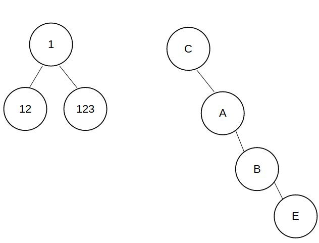

## Partie 2 : Manipulation des arbres

Une fois la classe de notre arbre crée nous allons écrire quelques fonctions/instruction permettant de les manipuler.

### 1. Création d'arbre :

Ecrire les instructions permettant de créer ces arbres ci-dessous :

### 2. Arbres dits "Peigne droit" 

Un arbre dit "peigne droit" est un arbre de hauteur h n'ayant aucun fils gauche. L'arbre ci-dessus C A B E est un peigne droit de hauteur 4.

1. Ecrire une fonction **peigne_droit(h : int)** prenant un entier h en paramètre et **renvoyant** un arbre dit "peigne droit" de hauteur h. (Les valeurs des nœuds de l'arbre n'ont pas d'importance (mais différente de None))
2. Ecrire une fonction **est_peigne_droit(a : Arbre)** prenant un Arbre a en paramètre et renvoyant True si l'arbre a est dit "peigne droit", False sinon.

### 3. Arbres parfaits

Un arbre parfait est un arbre qui possède le maximum de noeuds pour un taille donnée.

Un arbre parfait de hauteur 2 possède 3 noeuds, un arbre parfait de hauteur 3 possède 7 noeuds, etc ...

1. Ecrire une fonction **arbre_parfait(h : int)** prenant un entier h en paramètre et **renvoyant** un arbre dit "parfait" de hauteur h. (Les valeurs des nœuds de l'arbre n'ont pas d'importance (mais différente de None))
2. Ecrire une fonction **est_partfait(a : Arbre)** prenant un Arbre a en paramètre et renvoyant True si l'arbre a est dit "parfait", False sinon.
