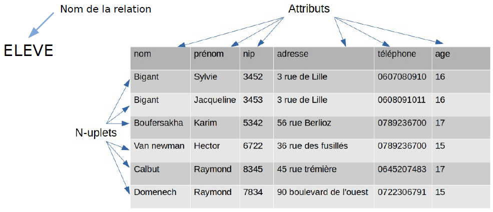

# Systèmes de gestion de bases de données (SGBD)

## 1. Stockage des données

Nous le savons, la base de l'informatique est de traiter, organiser et stocker des données. Ces données qui sont de plus en plus nombreuses (de manière exponentielle) depuis l'utilisation massive des systèmes numériques depuis ces dernières années.
Afin de stocker ces données, nous les avons organisé de façon à les utiliser de manière simple. Ces données stockées forment donc des **bases de données**.  

L'outil permettant de manipuler les bases de données est appelé **SGBD**(**S**ystème de **G**estion de **B**ases de **D**onnées), ces systèmes permettent notamment de gérer les problèmes de cohérence de données, de mise à jour de la base, d'interroger cette base, etc.

## 2. Modèle relationnel 

Le modèle relationnel est un ensemble d'outils permettant de gérer les problèmes de base de données, afin d'assurer la cohérence des données, la création, la mise à jours ou l'interrogation de la base.

On appellera **relation ou table** l'ensemble des enregistrements (des lignes, des n-uplet) de la base.
On appellera **attributs** les noms de colonnes de la table, chaque colonne acceptera un **type** de variable (nombre, texte, date...)
On appelle **schéma relationnel** l'ensemble des relations présentes dans une base de données. 

Ce schéma aura la forme suivante :

RELATION(A1,T1,...,....,An,Tn) ; A1 étant l'attribut 1 ayant un type T1.

ou

RELATION(A1 : T1,... : ....,An : Tn) ; A1 étant l'attribut 1 ayant un type T1.

Par exemple :	

- AUTEUR(<u>id</u> : Int, nom : String, prenom : String, ann_naissance : Int)
- LIVRES(<u>id</u> : Int, titre : String, #id_auteur : Int, genre : String) 

Les attributs soulignés sont des **clefs primaires**, le # **clef étrangère**. 

Chaque relation possède au moins un attribut que l'on appelle **clé primaire**. Cette dernière permet de rendre unique un n-uplet et il est impossible d'avoir 2 n-uplets avec pour même valeur sur la clé primaire.

En plus des clés primaires, nous avons aussi des **clés étrangères** qui permettent de faire la liaison entre les n-uplets d'une relation aux n-uplets d'une autre relation. En règle générale, si on trouve dans 2 relations **A** et **B** un même attribut et que ce dernier se trouve être la clé primaire de la relation **A**, alors cet attribut est une clé étrangère de la relation de **B**.

<u>Exemple d'une base de données utilisant le modèle relationnel :</u>

Ici :

- **Rel** est le nom de la relation ;
- **attr1, attr2, ...** sont les attributs de la relation.

Schéma relationnel : **ELEVE**(*nom* : String, *prenom* : String , *NIP* : String, *adresse* : String, *telephone* : String, *age* : Int)

## 3. Contraintes

Il existe différentes contraintes à respecter lorsque l'on manipule une base

- **Contrainte de Domaine**: seule les valeurs présente dans le domaine sont utilisables, chaque données possède un type précis afin que les différents choix possibles de celle-ci puissent être traités
- **Contrainte d'unicité**: une clé primaire ne peut prendre qu’une fois la même valeur ;
- **Contrainte entre relation (référentielle)**: Seules les valeurs présente dans la table de référence sont autorisées.

