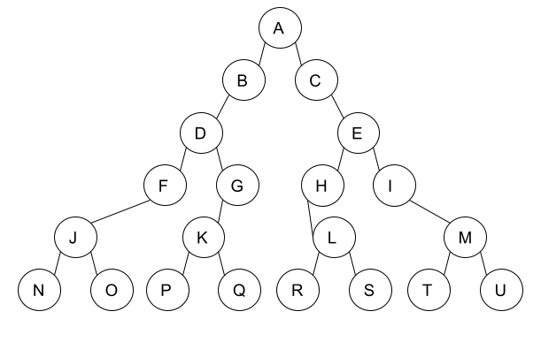

# Parcours d'arbres binaire

------

## 1. Notion de parcours

On appelle ici parcours le fait de passer sur tous les sommets d'un arbres (ou graphes). Nous voyons dans ce cours 2 méthodes de parcours.

Il y a : 

- Le parcours en largeur
- Le parcours en profondeur

## 2. Parcours en largeur

Le but d'un parcours en largeur est de parcourir la structure par niveau. On commence à partir d'un sommet, la racine pour un arbre binaire. 

Puis on parcours les sommets situé à une profondeur de 1, puis de 2. Ainsi de suite...

<u>Exemple :</u>

Voici le parcours en largeur proposé : A B C D E F G H I J K L M N O P Q R S T U

On remarque, que l'on fait niveau par niveau ici. 

## 3. Parcours en profondeur

Le but d'un parcours en profondeur est de parcourir la structure par chemins. En effet ici on commence avec la racine de l'arbre, puis avec l'un des fils, puis avec le fils de ce fils et ainsi de suite. Une fois arrivé en bas de l'arbre, on remonte et on fait pareil avec l'autre fils.

<u>Un exemple peut être plus parlant :</u>

### 3. 1. Parcours préfixe

Le parcours **préfixe** celui ci parcours l'arbre dans l'ordre suivant:

-  La racine
- Le fils gauche
- Le fils droit

> Ce qui donne ici : A B D F J N O G K P Q C E H L R S I M T U

### 3. 2. Parcours infixe

Le parcours **infixe** agit dans cet ordre :

- Le fils gauche
- La racine
- Le fils droit

> Ce qui donne ici : N J O F D P K Q G B A C R L S H E I T M U

### 3. 3. Parcours postfixe

Le parcours **postfixe** permet lui d'agir dans cet ordre :

- Le fils gauche
- Le fils droit
- La racine

> Ce qui donne ici : NO J F P Q K G D B R S L H T U M I E C A 
