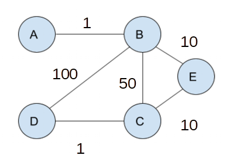

# Protocoles de routage : 

------

## 1. Rappel de première :

<u>Protocole :</u> est un ensemble de règles qui régissent les échanges de données ou le comportement collectif de processus ou d'ordinateurs en réseaux. Un protocole a pour but de réaliser une ou plusieurs tâches concourant à un fonctionnement harmonieux d'une entité générale. (Wikipédia) 

<u>Adresse IP :</u> Adresse permettant d'identifier chaque appareil connecté au réseau.

- Deux adresses appartiennent au même réseau si :
  - Leur adresse réseau est la même : 
    - 243.37.28.2/24 et 243.37.28.4/24 sont sur le même réseau, car les 24 premiers bits sont les mêmes (adresse réseau : 243.37.28.0/24)
    - 78.2.1.8/8 et 79.2.1.8/8 ne sont pas sur le même réseau, car les 8 premiers bits ne sont pas les mêmes (adresse réseau : 78.0.0.0/8 et 79.0.0.0/8)

## 2. Allocation d'adresses

<u>Comment les adresses IP sont attribuées ?</u>

Il existe un nombre fixe d'adresses IP (2\*\*32 pour les v4, 2\*\*128 pour les v6), ces adresses sont gérée par l'IANA (Internet Assigned Numbers Authority) (entreprise américaine privée) qui fixe l'attribution des adresses IP.

Ces adresses IP sont données par bloc aux RIR (Registres internet régional) qui eux même distribuent les adresses IP aux LIR (local internet registry), il en existe en France quelques centaines. Ces LIR délèguent les adresses aux fournisseurs internet qui les attribuent aux clients.

<u>Carte des différents RIP (Wikipédia) :</u>

Afin de communiquer avec le réseau internet notre réseau local à besoin d'un routeur, qui lui même connecté à d'autre routeurs créent internet.

La question à se poser maintenant pourrait être, comment les routeurs se repèrent ils dans le réseau ou encore comment les données parcourent le réseau.

## 3. Représentation du réseau et table de routage : 

Voici un réseau :

	

Afin de représenter les réseaux nous utiliserons les graphes : 

## 4. Premier protocole : RIP

Le protocole RIP est un protocole à vecteurs de distance c'est à dire qu'il n'y a pas une connaissance globale du réseau. Chaque routeur possède une table de routage avec la distance qui le sépare des autres routeurs connus. Au démarrage, les routeurs construisent leur table grâce à l'envoi régulier des données de chaque table de routage. Chaque routeur recevant ces données met donc à jour sa table de routage pour la renvoyer ensuite. Si dans une table de routage un chemin plus court est trouvé alors le routeur le met à jour.

Le protocole RIP compte au maximum 15 sauts, on ne peut donc pas relier un routeur situé à 17 sauts d'un autre avec RIP. De plus le protocole se base sur l'algorithme de Bellman-Ford pour déterminer le plus court chemin entre deux routeurs.

<u>Reprenons ce réseau :</u> 

A partir de celui-ci il est possible de créer les tables de routage des routeurs :

<u>Table du routeur A :</u>

| Destination | Métrique (Sauts/Distance) |
| ----------- | ------------------------- |
| A           | 0                         |
| B           | 1                         |
| C           | 2                         |
| D           | 2                         |
| E           | 2                         |

Le calcul du plus court chemin se fait donc par nombre de "sauts" pour le protocole RIP

**Détection des pannes :** Une panne est détectée lorsqu'un routeur ne reçoit pas de réponse à sa demande RIP, de ce fait le réseau se met à jour.

Exemple de plus court chemin :

- Le plus court chemin de A au routeur D se fait donc par B soit A B D avec un saut égal à 2.

## 5. Deuxième protocole : OSPF

Le protocole RIP permet de calculer les chemins en fonction du nombre de routeur entre deux destinations, malheureusement cette distance garantie pas que les routes soient les meilleures en terme de débit puisque la nature des liaisons n'est pas prise en compte dans le schéma du réseau.

C'est pour palier à ce problème le protocole OSPF fut développé dans les années 1990 par l'IETF (Internet Engineering Task Force) et prend en compte la bande passante des liaisons. 

Grâce au débit on calcule un coût qui sera déterminant dans la recherche du plus court chemin.

On admettra que : 

- Coût =  10**8 / débit, avec le débit en bits/s
- Débit  =  10**8 / Coût

<u>Ici le plus court chemin entre A et D est :</u>

- A -> B -> E -> C -> D  

### Les limites du protocole OSPF :

Le protocole OSPF peut avoir certaines limite concernant l'occupation d'une route, en effet si une route est saturée le protocole ne sera pas en mesure de changer le chemin et d'envisager un coût qui pourrait être en théorie plus important.
