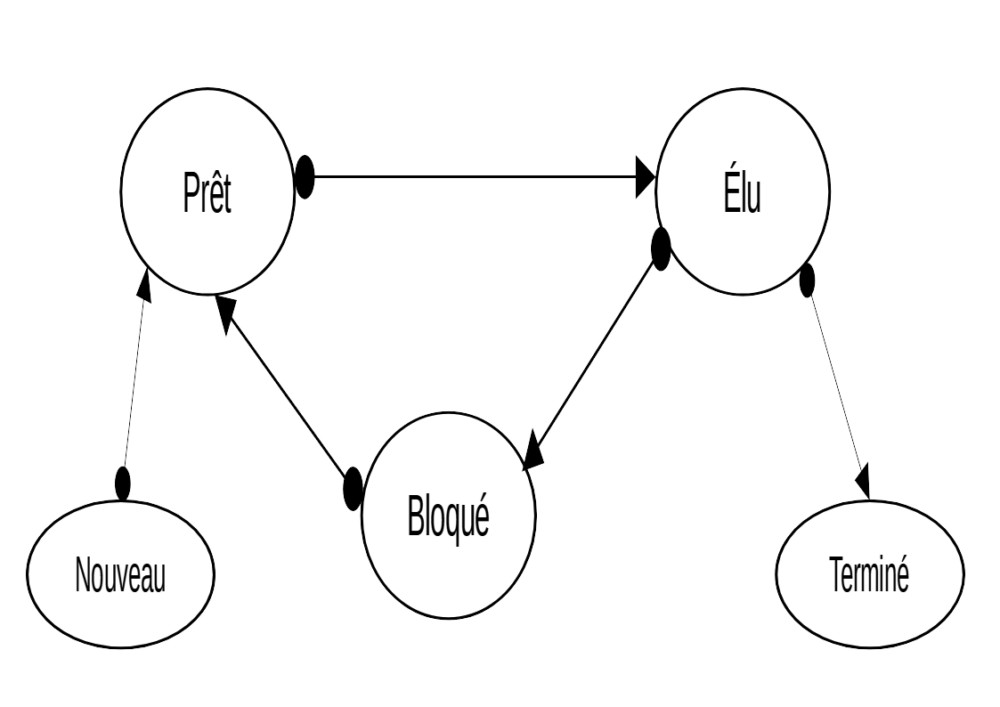
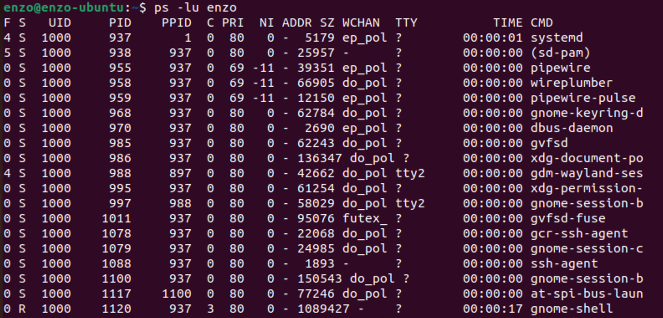

# Gestion des processus et des ressources

------

Nous le savons, un ordinateur possède une architecture de Von Neumann [Rappel 1ère], il y a donc divers composant tels que la mémoire vive, la mémoire 'dure' (Disque dur, SSD...), de périphériques et d'un processeur.

Le processeur est le 'cerveau' de l'ordinateur et c'est lui qui exécute les tâches de celui-ci. 

Mais alors comment expliquer que notre processeur arrive à ouvrir un navigateur web, un lecteur de musique, télécharger un jeu ou encore envoyer des messages le tout simultanément. (Sans parler des tâches de fond de l'ordinateur)

Tout ces programmes sont en réalité des lignes immenses de code et le processeur lui agit seul. Il exécute une à une les instructions de chaque programme, mais donne la sensation de tout gérer en même temps.

> Les processeurs multi-cœurs fonctionnent de la même façon à l'exception près qu'il n'y à pas 1 cœur, mais 4 voir 8 cœurs. Mais au vu des multitudes de programmes tournant en même temps sur la machine, le nombre de cœurs est nettement inferieur.

## 1. Notion de processus 

Lorsqu'un programme est exécuté, il créer plusieurs processus. En effet, un programme est composé de diverses instructions (lignes de code) qui elles mêmes forment diverses parties (processus) de celui-ci.

Ces processus sont donc stocker dans une file (tout cela est géré par l'OS [Rappel 1ère])  et sont exécutés un à un.

*Exemple de répartition de deux programmes par l'OS :*


## 2. Gestion des processus 

Nous l'avons vu chaque processus possèdent plusieurs informations. **L'état** d'un processus permet de comprendre comment la file d'exécution est créer et comment celle-ci perdure. 

Il existe 3 états différent : 

- Prêt : Le processus attend d'être exécuté. Il est dans la file d'exécution.
- Elu : En cours d'exécution
-  Bloqué/En attente : Le processus nécessite une ressource non disponible. Tel qu'un emplacement mémoire, une entré/sortie.
  Lorsque la ressource sera disponible, le processus repassera en état prêt.
  - On peut imaginer que le processus attend l'intervention de l'utilisateur, ou le chargement d'une ressources (donc d'autres processus), etc.

Il existe aussi deux autres états :

- Nouveau : le processus vient d'être crée, il n'est pas encore dans la file d'exécution
- Terminé : l'exécution du processus est finie.

<u>Voici un schéma des différents états :</u>



## 3. Interblocage :

L'interblocage intervient lorsque plusieurs processus sont bloqués les un aux autres. 
Imaginons deux programme.

```
# Programme 1 :
	Accès à la ressource A
		Accès à la ressource B
			....
		Libération de ressource B
	Libération de ressource A
```

```
# Programme 2 :
	Accès à la ressource B
		Accès à la ressource A
			....
		Libération de ressource A
	Libération de ressource B
```

### 3. 1. Un exemple d'ordonnancement 

```
# Programme 1 :
	Accès à la ressource A
		Accès à la ressource B
```

- Le programme 1 a commencé via un premier processus. Afin de faire tourner tous les programmes 'en même temps' il repasse dans la file d'exécution

```
# Programme 2 :
	Accès à la ressource B
	....
```

- Ici l'accès ne peut se faire, le programme 2 passe donc en état **Bloqué**

```
# Programme 1 :
	....
		Libération de ressource B
	Libération de ressource A
```

- Le programme 1 se termine et donc libère A et B

```
# Programme 2 :
	Accès à la ressource B
		Accès à la ressource A
			....
		Libération de ressource A
	Libération de ressource B
```

- Le programme 2 peut donc s'exécuter normalement

### 3. 2. Mauvais ordonnancement :

```
# Programme 1 :
	Accès à la ressource A
```

- Le programme 1 créer un premier processus, qui appelle la ressource A

```
# Programme 2 :
	Accès à la ressource B
```

- le programme 2 créer un premier processus, qui appelle la ressource B

```
# Programme 1 :
		Accès à la ressource B
```

- Le programme 1 attend la ressource B utilisée par le programme 2 et passe en état bloqué.

```
# Programme 2 :
		Accès à la ressource A
```

- Le programme 2 attend la ressource A utilisée par le programme 1 et passe en état bloqué.

Ici les deux programmes sont en état bloqué car chacun attend la ressource de l'autre. Il y a interblocage et donc aucuns des programmes ne peut s'exécuter.

## 4. En pratique :

### 4. 1. Informations processus

Chaque processus possèdent diverses informations stockées en mémoire (dans le PCB (*Process Control Block*)) comme : 

| Nom        | Description                                                  |
| ---------- | ------------------------------------------------------------ |
| PID        | Process ID, identifiant du processus                         |
| PPID       | Parent ID, il s'agit du processus parent ayant lancé le processus en cours (PID) |
| Etat       | Etat du processus                                            |
| Registre   | Valeur des registres lors de la dernière interruption        |
| Mémoire    | Emplacement mémoire, allouée par le processeur               |
| Ressources | Ressources utilisées par le processus.                       |

### 4. 2. Windows

Sous windows il est possible de voir les processus en cours d'exécution grâce au **gestionnaire de tâche**. Celui-ci est accessible grâce aux touches Ctrl+ Maj+Echap.
Il suffit ensuite d'aller dans l'onglet détail et on obtient tous les processus.


Nous retrouvons bien, l'**état**, le **PID**, la **mémoire occupée** 

### 4. 3. Linux et ses commandes :

Sous linux, il suffit d'accéder au terminal. Et d'y écrire la commande **ps**, il est possible de voir les **PID** et **PPID** (processus parent)



Sous linux il existe différentes commandes permettant d'agir sur ces processus, celle-ci sont à connaître.

| Commande | option                                                       | Utilité                                   | Exemple     |
| -------- | ------------------------------------------------------------ | ----------------------------------------- | ----------- |
| ps       | -l (L minuscule)(permet d'afficher plus d'informations sur les processus) / u permet d'affecter le profil associé aux processus (propriétaire) | Permet d'afficher les processus en cours. | ps -lu user |
| kill     | -9 permet de couper le processus instantanément              | Permet de couper un processus.            | kill 937    |

