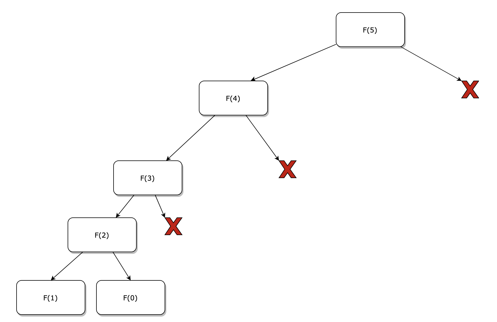
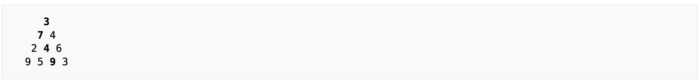

# Programmation dynamique :

------

## 1. Historique :

L'histoire de la programmation dynamique remonte aux années 1940 et  1950, avec le mathématicien [Richard Bellman](https://fr.wikipedia.org/wiki/Richard_Bellman)  qui a été le pionnier de  cette technique. Il a été l'un des premiers à formaliser et à développer des idées fondamentales dans ce domaine.

Le terme "programmation dynamique" a été inventé par Bellman dans les  années 1940 alors qu'il travaillait sur des problèmes d'optimisation. À  l'époque, il travaillait pour l'US Air Force sur des problèmes de  contrôle et de planification de projet. Pour des raisons de sécurité, il a utilisé le terme "programmation dynamique" pour décrire son approche, afin de dissimuler le véritable objectif de ses recherches.

## 2. Principe :

La programmation dynamique est une technique algorithmique utilisée pour résoudre des problèmes qui peuvent être décomposés en sous-problèmes plus petits et qui se retrouvent souvent. Les sous problèmes sont tous traités et leurs résultats **stockés** afin de pouvoir être réutilisés. Cette technique utilise donc un espace mémoire qui ne sera pas à négliger. La compléxité en **espace** ne sera donc pas égale à O(n) (compléxité rencontrée dans la plupart des cas de figure jusqu'à présent)

### 2. 1. Différence avec la méthode 'Diviser pour régner' :

A la différence de la méthode diviser pour régner ici les résultats des sous problèmes sont enregistrés. En effet ces sous problèmes sont rencontrés plusieurs fois à la différence de la méthode diviser pour régner qui n'utilise pas des sous problèmes communs.

### 2. 2. Différence avec les algorithmes gloutons :

<u>**Algorithme glouton :**</u> Algorithme prennant des décisions localement optimales à chaque étape sans considérer les conséquences globales. Il choisit la meilleure option disponible à chaque étape, ce qui peut conduire à une solution globale sous-optimale dans certains cas. 

Il n'y a pas ici des sous problèmes à gérer, juste une règle (suite d'instruction) à suivre de manière locale et à appliquer pour obtenir un résultat qui sera **peut être** optimal.

## 3. Différentes méthodes :

Il existe pour la programmation dynamique deux méthodes, une méthode dite **ascendante** et une **descendente**. Pour les expliquer nous utiliserons la suite de Fibonaci. (Disclamer : La suite de Fibonacci n'est pas un problème de programmation dynamique puisqu'il n'y a pas de solution optimale, il n'y a ici qu'une solution pour chaque élément de la suite (mais la méthode s'y applique très bien))

### 3. 1. Méthode naïve :

```python
 
```

Méthode classique, celle-ci permettra d'avoir les 1000 premières valeurs en peu de temps (et encore). Mais après cela demandera plusieurs minutes pour résoudre le problème. Mais pourquoi donc ?

Cette fonction fait des appels récursifs répétitifs. Prenons en exemple Fibonacci(5), pour le résoudre :

- Fibonacci(4) + Fibonacci(3)
-  = Fibonacci(3) + Fibonacci(2) + Fibonacci(2) + Fibonacci(1)
- = Fibonacci(2) + Fibonacci(1) + Fibonacci(1) + Fibonacci(0) + Fibonacci(1)
- = Fibonacci(1) + Fibonacci(0) + Fibonacci(1) + Fibonacci(1) + Fibonacci(0) + Fibonacci(1)

Cela fait énormement d'appels de fonctions pour le 4ème élément de la suite. De plus tout ces appels sont les mêmes, inutile de les recalculer.

### 3. 2. Méthode descendante :

```python
def dscFibonacci(n, dico):
    if n == 0 or n == 1:
        return n
    if n in dico and dico[n] != 0 :
        return dico[n]
    dico[n] = dscFibonacci(n - 1, dico) + dscFibonacci(n - 2, dico)
    return dico[n]
```

Cette méthode peut être illustrée comme ceci :



On part du cas **n** puis on calcule récursivement les autres, mais 1 seule et unique fois. Si le cas à déjà été traité, alors on va le rechercher dans le dictionnaire (ou tableau) et on le renvoie.

### 3. 3. Méthode ascendante :

```python
def ascFibonacci(n) :
  if n in [0,1] :
    return n
  tab = [0,1]
  for i in range(2,n+1):
    tab.append(tab[i-1]+tab[i-2])
  return tab[n]
```

Ici on construit le tableau contenant la suite de Fibonacci jusque **n** puis on renvoie le dernier élément de ce tableau.

## 4. Cas d'applications :

<u>Pyramide de nombres :</u> Retrouver le chemin ayant la somme maximale des nombres parcourus.



Ici la somme maximale est : 3 + 7 + 4 + 9 -> 23

<u>Problème du rendu de monnaie :</u> Comment à partir d'une somme et d'un ensemble de pièces/billets rendre le moins de pièces possibles. Les systèmes monétaires possibles peuvent être l'euro [50, 20, 10, 5, 2, 1] ou le un ancien système impérial britannique [30, 24, 12, 6, 3, 1]

<u>Problème du sac à dos :</u> On dispose ici d'un sac à dos ayant une capacité maximale de x kg et d'un ensemble d'objets ayant un poids et une valeur. Le but ici, remplir le sac à dos sans le surcharger. La valeur maximale possible doit être atteinte. 

Afin de représenter les éléments du sac à dos ainsi que leur valeurs on peut imaginer une structure en tableau composé de tuples ayant pour éléments (valeur,poids), le sac à dos lui aura une valeur maximal décrite par un entier e

-  [(1,1),(2,6),(5,18),( 6,22),(7,28)] et 11
