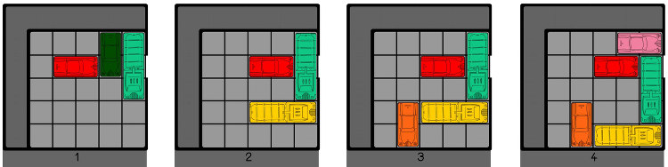

# Mini projet : Rush hour

## 1. Présentation du jeu :

Le jeu du Rush hour, est un jeu de casse tête. Il est composé d'un plateau dans le quel il y aura un embouteillage de voitures, elles sont toutes les unes à cotées des autres et le véhicule "rouge" doit sortir du plateau. (Wikipédia](https://fr.wikipedia.org/wiki/Rush_hour_(casse-t%C3%AAte)))

Les autres voitures elles ne peuvent qu'avancer ou reculer dans une direction.

Il y a deux types de véhicule :

-  Les voitures sur deux cases
- Les camions sur trois cases

Le but ici est évidement de faire jouer l'ordinateur et de proposer une interface avec tous les mouvement à faire pour finir un niveau.

 ## 2. Condition de rendu :

Ce projet est dit "mini" donc il n'y à pas de dossier à rendre, ni de diaporama à faire. Il peut cependant y avoir une présentation du projet à faire en classe.

Le code est donc le seul rendu à faire.

## 3. Pistes pour le code python :

Il faut penser aux classes pour ce projet : 

- Une classe game, contenant le plateau de jeu et les mouvement possibles 
- Une classe véhicule, contenant les véhicule d'un niveau
- Un solver (un code qui résout le niveau)
- Le jeu est lié aux cours sur les graphes, la récursivité, File et la programmation objet.

Aucune interface n'est demandée, seul la liste des mouvement à faire pour finir un niveau.

Exemple :



*Source : https://maternelle-bambou.fr/jeu-embouteillages-rush-hour/*

Pour résoudre le niveau 1 l'affichage peut être le suivant :

```python
>>> Voiture (V) en (3,0) avance de 2
>>> Camion (V) en (4,0) avance de 2
>>> Voiture rouge (H) en (1,1) avance de 4
>>> Problème résolu
```