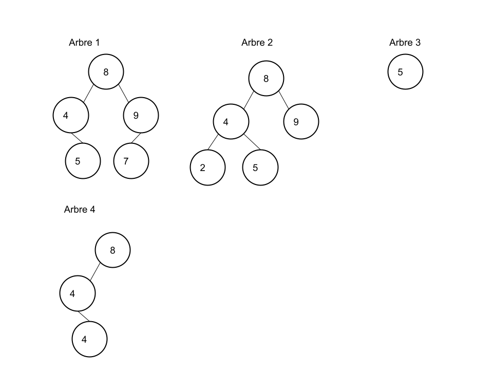

# Interrogations : Arbres

------

## 1. Partie programmation :

<u>Voici la classe Arbre :</u>

```python
class Arbre :
    """Classe Arbre, permettant de créer des arbres binaire"""
    def __init__(self,valeur=None,fils_gauche=None,fils_droit=None):
        """
        Méthode constructeur permettant de créer un arbre
        param valeur : (int/str) Valeur du noeud
        fils_gauche/fils_droit : (Arbre/None) Fils gauche/droit de l'arbre
        """
        self.valeur = valeur
        self.fils_droit = fils_droit
        self.fils_gauche = fils_gauche
```

1. Ecrire la (les) instruction(s) permettant de créer un arbre de 4 nœuds
2. Ecrire la **méthode** Taille( ), permettant de calculer la taille d'un arbre
3. Ecrire un test permettant d'appliquer la méthode taille( ) à un arbre.

## 2. Application de cours :

1. Dessiner tous les arbres ayant 4 nœuds

2. Dessiner un arbre ayant une hauteur égale à 5 et une taille égale à 12

3. Qu'est ce qu'un ABR ? 

4. Parmi les arbres suivants les quels sont des ABR ? 

   