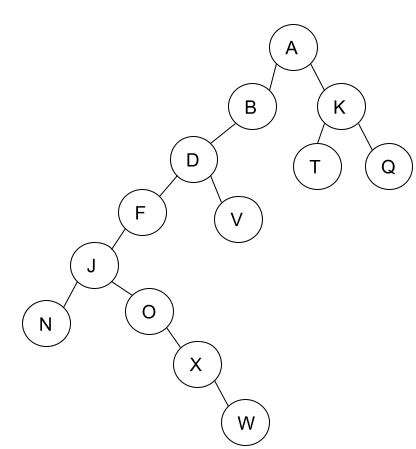

# IE Graphes :

------

## Exercice 1 :

1.  Ce graphe est il orienté ou non orienté? Pourquoi?
2. Déterminer, l'ordre et les degrés de chaque sommet de ce graphe.

Bonus. Quel est la longueur du plus grand chemin de ce graphe, quel est le sommet de départ et d'arrivé

3. Représenter ce graphe par son dictionnaire d'adjacence.
4. Quelles sont les autres représentations informatique possible pour un graphe ?

## Exercice 2 :

|       | Fanny | Bob  | Alice | Mehdi | Emma | Tim  |
| ----- | ----- | ---- | ----- | ----- | ---- | ---- |
| Fanny |       |      |       |       | X    | X    |
| Bob   |       |      | X     |       |      |      |
| Alice | X     |      |       | X     |      |      |
| Mehdi |       | X    |       |       |      |      |
| Emma  |       |      | X     |       |      |      |
| Tim   |       |      | X     |       |      |      |

Ce tableau se lit comme suivit : Alice suit Fanny sur un réseau.

1. Le graphe est il orienté ou non orienté? Pourquoi?
2. A partir de ce tableau, dessiner le graphe correspondant.
3. Donner la représentation informatique en matrice, en dictionnaire de ce tableau.