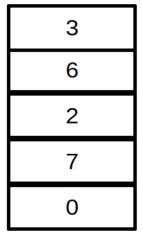
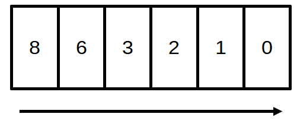

# Interrogation PILE/LISTE CHAINNEE/FILE

------

**Pour chaque question, il est possible de faire un schéma pour appuyer la réponse écrite**

## Exercice 1 : 

1. Expliquer le concept de liste chaînée
2. Expliquer le concept de Pile
3. Expliquer le concept de File

## Exercice 2 : Liste chaînées

1. Quelle est l'interface d'une liste chaînée
2. Illustrer l'insertion d'un élément dans une liste.
3. Comment vérifions nous si une liste chaînée est vide ?

## Exercice 3 :

1. Expliquer la différence entre implémentation et interface
2. Quelle est l'interface d'une Pile ?
3. Quelle est l'interface d'une File ?
4. Voici une pile : *(On suppose 0 en bas de pile)*
   1. Ecrire une suite d'instructions permettant de retrouver la pile suivante : 0 8 1 8 3 (0 en bas de pile)
5. Voici une file :  *(Sens défini par la flèche)*
   1. Ecrire une suite d'instruction permettant de retrouver la file suivante : 0 1 2 3 6 8