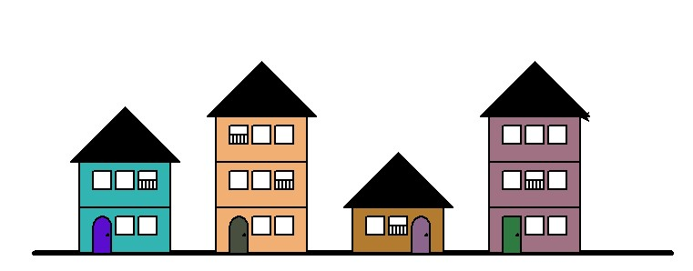

# Liste projet POO :

Tout projet doit **obligatoirement** être écrit en POO (avec classes), ces classes doivent interagir entre elles. Une interface en 2D peut être proposée, mais celle-ci ne doit pas occuper tout le temps du projet (car très peu prise en compte dans la notation).

## Modélises ton avenue (Turtle) :

Il s'agit ici de dessiner une avenue avec le module Turtle en suivant le modèle ci-dessous :

Ce qu'il faut savoir :

- Tout est généré aléatoirement (couleur, nombre d'étages, balcon ou non)
- Il y a forcément 4 immeubles ayant 0 à 3 étages (+ rdc)
- Différents types de toits
- Différents types de portes
- Le rendu ci-dessus est un rendu de base, il faudra rajouter d'autres modélisations pour le rendu final.

## Projet RPG :

Un autre type de projet est de créer un mini RPG dans le quel un personnage affronterai des vagues de monstres, se baladerai dans un donjon créé vous même et évoluerait au fil du temps. 

Libre ici, tout le projet est dit "bac à sable" (on ne part de rien, pas de contraintes)

